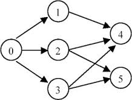

##Topological Sorting

25% Accepted

    Given an directed graph, a topological order of the graph nodes is defined as follow:

    For each directed edge A -> B in graph, A must before B in the order list.
    The first node in the order can be any node in the graph with no nodes direct to it.
    Find any topological order for the given graph.

    For graph as follow:



         The topological order can be:

         [0, 1, 2, 3, 4, 5]
         [0, 2, 3, 1, 5, 4]

####Note
You can assume that there is at least one topological order in the graph.

####Challenge
Can you do it in both BFS and DFS?

####Tags Expand
- LintCode Copyright
- Geeks for Geeks
- DFS
- BFS

####思路
- BFS方法


```java
/**
 * Definition for Directed graph.
 * class DirectedGraphNode {
 *     int label;
 *     ArrayList<DirectedGraphNode> neighbors;
 *     DirectedGraphNode(int x) { label = x; neighbors = new ArrayList<DirectedGraphNode>(); }
 * };
 */
public class Solution {
    /**
     * @param graph: A list of Directed graph node
     * @return: Any topological order for the given graph.
     */
 public ArrayList<DirectedGraphNode> topSort(ArrayList<DirectedGraphNode> graph) {
        // write your code here
        ArrayList<DirectedGraphNode> result = new ArrayList<DirectedGraphNode>();
        HashMap<DirectedGraphNode, Integer> map = new HashMap();
        /*
        先进行入度计算，用的哈希表储存
         */
        for (DirectedGraphNode node : graph) {
            for (DirectedGraphNode neighbor : node.neighbors) {
                if (map.containsKey(neighbor)) {
                    map.put(neighbor, map.get(neighbor) + 1);
                } else {
                    map.put(neighbor, 1);
                }
            }
        }
        /*
        然后找到根节点(入度为0)
         */
        Queue<DirectedGraphNode> q = new LinkedList<DirectedGraphNode>();
        for (DirectedGraphNode node : graph) {
            if (!map.containsKey(node)) {
                q.offer(node);
                result.add(node);
            }
        }
        /*
         对图遍历，每次遇到节点，该节点入度减一，当入度为0时，说明前面的遍历完了
         */
        while (!q.isEmpty()) {
            DirectedGraphNode node = q.poll();
            for (DirectedGraphNode n : node.neighbors) {
                map.put(n, map.get(n) - 1);
                if (map.get(n) == 0) {
                    result.add(n);
                    q.offer(n);
                }
            }
        }
        return result;
    }
}
```

####DFS方法
- 跟BFS一样
- 先找indegree
- 在对indegree == 0 的点,去进行DFS,DFS过程中,对该点的neighbor indegree减1,如果neighbor indegree = 0,那么递归这个点
