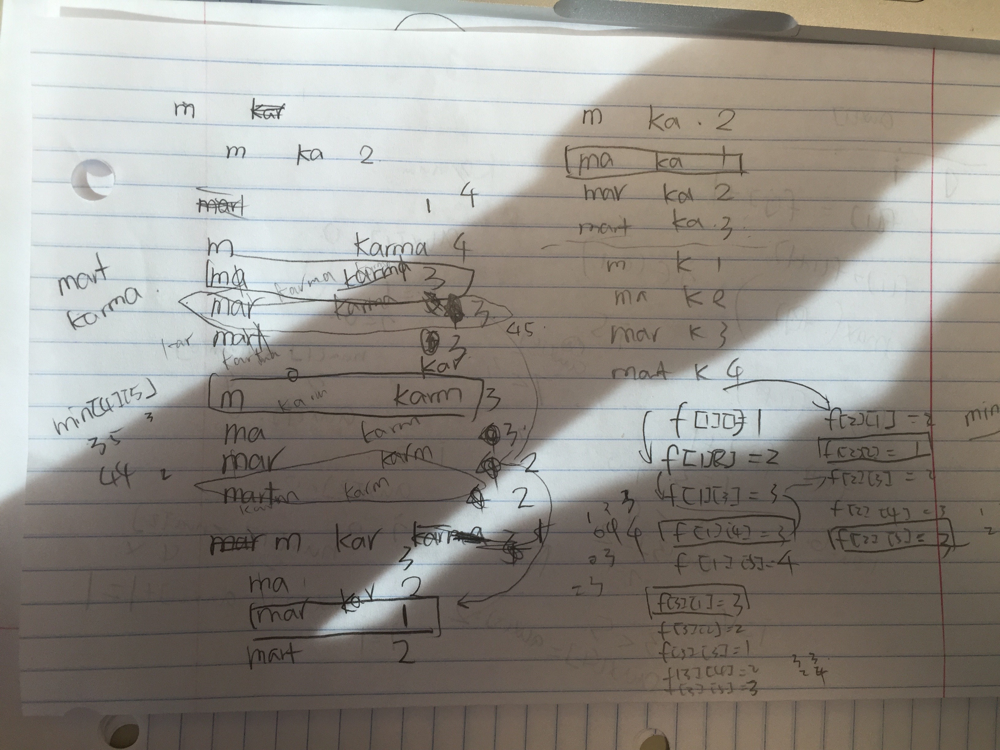

##Edit Distance

29% Accepted

	Given two words word1 and word2,
    find the minimum number of steps required to convert word1 to word2. (each operation is counted as 1 step.)

	You have the following 3 operations permitted on a word:

	Insert a character
	Delete a character
	Replace a character
	Have you met this question in a real interview? Yes
	Example
	Given word1 = "mart" and word2 = "karma", return 3.

####Tags Expand
- String
- Dynamic Programming

####思路
- 想规律，实在不行就把例子划出来画图找规律
- 从宏观上去思考规律，画出来的只是辅助出来找规律的


```java
public class Solution {
    /**
     * @param word1 & word2: Two string.
     * @return: The minimum number of steps.
     */
    public int minDistance(String word1, String word2) {
        // write your code here
        if (word1 == null || word1.length() == 0) {
            return word2.length();
        }
        if (word2 == null || word2.length() == 0) {
            return word1.length();
        }
        int[][] min = new int[word1.length()+1][word2.length()+1];
        //初始化边界条件容易出错 这里应该是<= word1.length()
        //第一次写就写成了< word1.length()
        for (int i = 0; i <= word1.length(); i++) {
            min[i][0] = i;
        }
        for (int i = 0; i <= word2.length(); i++) {
            min[0][i] = i;
        }
        for (int i = 1; i <= word1.length(); i++) {
            for (int j = 1; j <= word2.length(); j++) {
                if (word1.charAt(i-1) != word2.charAt(j-1)) {
                    //注意这个Min的取值 是连续取两次
                    //如果长度相等的时候，需要的是replace 所以是min[i-1][j-1] + 1
                    min[i][j] = Math.min(Math.min(min[i-1][j],min[i][j-1]), min[i-1][j-1]) + 1;
                } else {
                    min[i][j] = min[i-1][j-1];
                }
            }
        }
        return min[word1.length()][word2.length()];
    }
}

```
